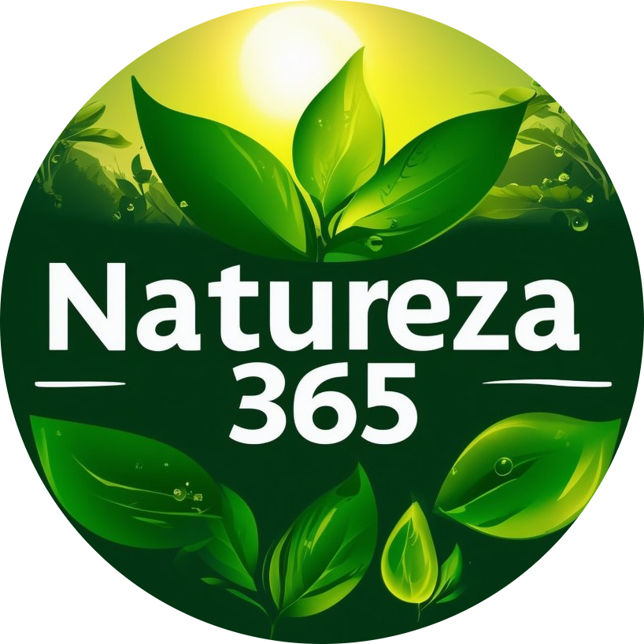
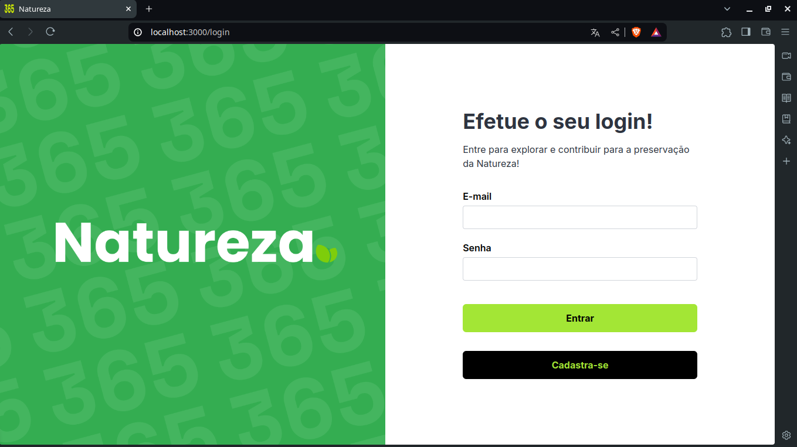

### Natureza 365

<h1 align="center">
  
</h1>


## Stacks

Esse projeto do Módulo II foi desenvolvido com as seguintes tecnologias:

- [JavaScript](https://developer.mozilla.org/en-US/docs/Web/JavaScript)
- [TypeScript](https://www.typescriptlang.org/)
- [ReactJS](https://reactjs.org)
- [Vite](https://vitejs.dev)
- [Next](https://nextjs.org/)
- [Tailwind CSS](https://tailwindcss.com/)


## 🚀 Como executar

Clone o projeto e acesse a pasta do mesmo.

```bash
$ git clone https://github.com/anaisa-teodoro/projeto-front-end-one-version1.git
$ cd projeto-front-end-one-version1
```
Utilize uma versão específica do Node a ser usada no projeto. Use o comando abaixo no seu terminal para salvá-la.

```bash
node -v >.nvmrc
```
Para iniciá-lo, siga um dos passos abaixo:
```bash
# Instalar as dependências com Yarn
$ yarn
# Iniciar o projeto
$ yarn dev
# Instalar e iniciar as dependências com NPM
$ npm install && npm run dev
# Outros meios para iniciar o projeto
pnpm dev
# ou
bun dev

```
Ao rodar um dos comandos, inicia-se o servidor e aparecerá a seguinte mensagem no seu terminal: 

```bash
> app-react@0.1.0 dev
> next dev

  ▲ Next.js 14.2.4
  - Local:        http://localhost:3000

 ✓ Starting...
 ✓ Ready in 2.2s

```
Clique na URL local, conforme demonstrado no passo anterior para abrir uma janela na preferência do seu navegador, conforme a imagem:

<h1 align="center">
  
</h1>


## 💻 Projeto

Esse projeto Natureza 365 é uma plataforma que permite aos usuários explorar e contribuir para a preservação da natureza, fornecendo acesso a informações sobre áreas de preservações naturais, trilhas, parques ecológicos, reservas ambientais e outros locais de interesse para os amantes da natureza. Focada no Front-end com a biblioteca do React tem intuito de facilitar esse cadastro e disponibilizar a listam para consulta online.

## 📋 Organização do Trabalho:

[🔗 Link do Trello](https://trello.com/b/4YnWqsCV/projetomoduloii)


## 🔖 Layout

Você pode visualizar a base de design e layout do projeto II que foi inspirada através do link abaixo:

- [Layout Web](https://www.figma.com/design/QVcbYrMEXZDWbSgLG2HsOG/ativa365?node-id=66-1057)

## 📝 Créditos finais

#### Repasso os devidos créditos a esse projeto:
- O designer do Figma inspirado foi desenvolvido pelo Developer [Nicholas Macedo](https://github.com/nicholasmacedoo).
- Flick foto de Florianópolis de autoria de [Rômulo Ferreira](https://www.flickr.com/photos/133918326@N07/19565692931/in/photolist-vNXhRi-ZAv1m5-vaM5L5-2nm4uyt-o5TiB-QxPfF3-vrPNXJ-7C6RVu-uvvSGP-2nY29Za-bbnkVr-28kwoHg-btVD87-5WTANr-9WkAu-bppqWC-kyz7iz-QxPaAy-8vRWSu-apsRQX-8r4pgf-bbnkf4-RJ7KQ-B6v6w4-H9doM9-5wbA6s-jB9h63-ajru9Z-235oGKe-bCjme6-6Pje6K-4B2kAr-4B2jft-e6Zxo-4B6yZ3-aPmJHe-4B2k8r-9xzR5a-qiQiqZ-2fAuhmy-vsmqoM-pyijtL-e6ZJ2-6KyxrH-bbnmDK-vaME73-KXtYTt-MzGxom-DZniAw-DSZV32).
- Logo do Natureza365 foi gerada num bot do [Telegram](https://web.telegram.org).

---


💖 Feito com 💜 by Anaísa Mayara Teodoro 💻 e muito aprendizado nas aulas do FuturoDEV! 📚
